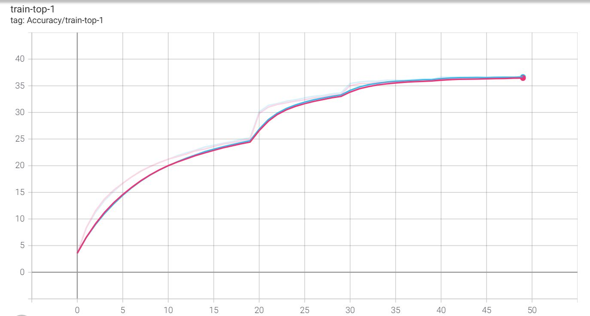
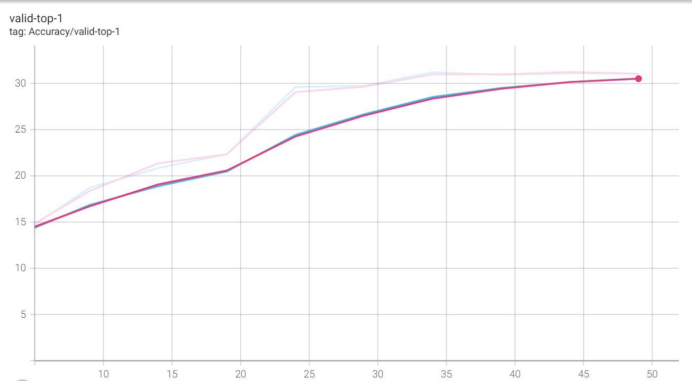
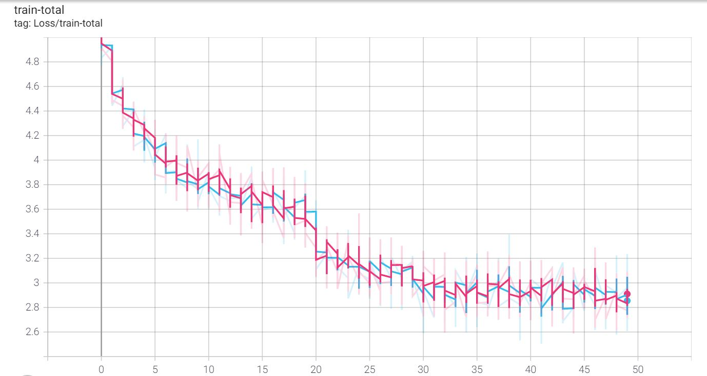
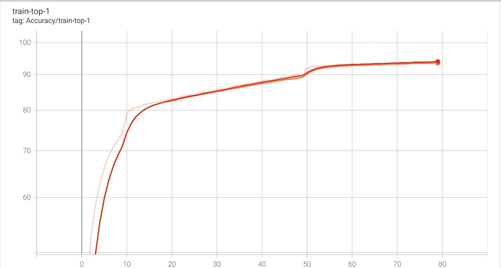
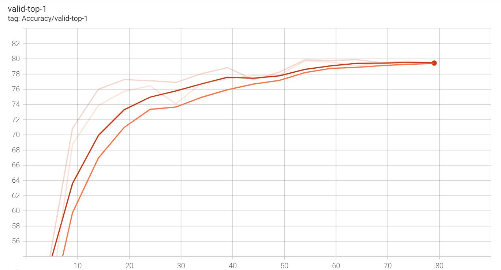
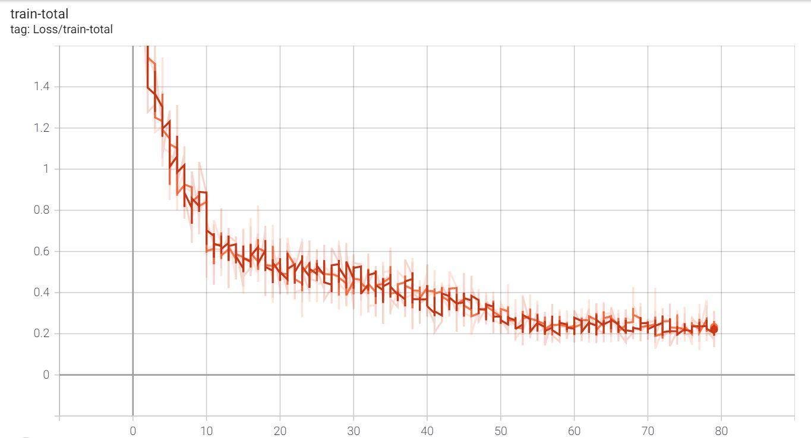

# **4-D STGCN**

## **Introduction:**

A graph convolutional network for skeleton based action recognition. [This paper](https://arxiv.org/abs/1801.07455) proposed a novel model of dynamic skeletons called Spatial Temporal Graph Convolutional Networks (ST-GCN), which moves beyond the limitations of previous methods by automatically learning both the spatial and temporal patterns from data. The proposed approach also has greater generalization capability than existing approaches.

Kindly refer to the below link for the code repository of the paper, which holds the codebase, dataset and models:
[Github](https://github.com/kenziyuliu/st-gcn)

## **What is different in this repository:**

While maintaining the same performance and flexibility in both training and inference, in this repository, we change the original model implementation from `5D` input to `4D` input, and replace the `Einsum` operator with the equivalent `Matmul` operation, enabling the model for more general usage on non-GPU/CPU devices. For example, for Huawei's Ascend AI processor, by the date of this repository, the CANN software stack does not support `5D` or `Einsum` yet. This could apply to other ASIC/FPGA AI processors. Details are provided in the below sections.

# **Prerequisites:**
1)  `Python3`
2)	[`PyTorch`](https://pytorch.org/)
3)	[`Openpose`](https://github.com/CMU-Perceptual-Computing-Lab/openpose)
4)  `pip install onnx` for Pytorch to onnx conversion 
5)	Create conda environment to install dependencies
6)	All other dependencies use `pip install -r requirements.txt`
7)  After cloning repo, run the following:

    `cd torchlight`; 
    `python setup.py install` ;
    `cd ..`

# **Dataset Preparation:**

The original paper is tested on two skeleton dataset generated from the **Kinetics** dataset and **NTU RGB+D**. The scripts to generate skeletons are provided in the paper's repo and forked here in `tools/`. Alternative, the original paper also provides processed skeleton data that can be download direclty. Details as below.

## <u>**Kinetics Skeleton:** </u>

Kinetics dataset contains 400 human action classes, with at least 400 video clips for each action. Each clip lasts around 10s. Skeletons from each frame are extracted using Openpose and the resultant dataset is called kinetics-skeleton.

Dataset can be downloaded (7.5GB) from the this [Google Drive](https://drive.google.com/drive/folders/1SPQ6FmFsjGg3f59uCWfdUWI-5HJM_YhZ) as provided in the original git repository.

After uncompressing, the database can be built by the scirpt provided by the original repo:

`python tools/kinetics_gendata.py --data_path <path to kinetics-skeleton>`

## <u> **NTU RGB+D:** </u>

NTU RGB+D contains 60 action classes and 56,880 video samples. The dataset contains RGB videos, depth map sequences, 3D skeletal data, and infrared (IR) videos for each sample. 

As stated in the original paper, only the 3D skeletal data was used for the experiments. Dataset can be downloaded from [their website](https://drive.google.com/file/d/1CUZnBtYwifVXS21yVg62T-vrPVayso5H/view)

The following script is provided from the orignal repo to build the database for training or evaluation:

`python tools/ntu_gendata.py --data_path <path to nturgbd+d_skeletons>`

# **Model Change Details**

## **Tensor dimensions 5D->4D :**

As mentioned above we used both datasets for model training, evaluation and inference. Both datasets have train and validation sets.

1. Data from the data loader is loaded  as 5-dimensional (5D) tensors as **N, C, T, V, M** corresponding to **batch size, channels, number of sequences, number of joints/ graph nodes, number of persons**.

2. We merged dimensions to create 4D tensors before passing it to the model for prediction. We used the approach of merging **V** and **M** (number of graph nodes and number of persons) dimensions. **V = 18 and V = 25** for kinetics-skeleton and NTU RGB+D datasets respectively. For both datasets, **M = 2.**. Resultant tesnor was of shape **'N, MV, C, T'**

3. Code changes also supports dynamic N, C, T, V, M values. For instance, a dataset can contain only a single or multiple persons in an input frame, number of vertices/graph nodes in spatial domain can be varied depending on the type pose estimate algorithm used. We have handled these scenarios and no further code changes are required for training and validation.

## **Einsum Replacement with Matmul:** 
Let’s first understand its working below:

### <u>**Einsum working:** </u>

1. The working of einusm is similar to that of Matrix multiplication under the hood. One such advantage of einsum is that it handles multiplying matrices with different dimensions without explicitly stating transpose and permute operations.

2. In the above example, we can see the input matrices of shape **(2,3 - > i,k)** and **(5,3 -> j,k)**. Einsum operator multiples across the **‘k’** dimension to create resultant matrix of **(2,5 -> i, j)** dimension. 
    
3. We used matrix multiplication as an alternative to Einsum for its operation on the AI processor.

### <u>**Matmul Working:** </u>

1. As seen above, we need to explicitly match the dimensions (transpose) before the matmul operation **(i,k , k,j -> i, j)** to create resultant matrix.

## **Code Implementation:**

### <u>**Changes in recognition.py :**</u>

As stated above, data is loaded as a  4D tensor during training and validation to be compatible with Ascend AI processor.

1. Changes were made in the train and test functions. Data from the loader were used to view and merge **V** and **M** dimensions before passing it to the model. 

2. Resultant tensor shape was **'N, MV, C, T'**

### <u>**Changes in tgcn.py :** </u>

Einsum replacement with matmul was implemented in the tgcn.py:

**Original st-gcn:**

1. Inputs to the einsum are basically two matrices ‘x’ and ‘A’. x is formulated as a 5D tensor with **NM, K, C, T, V**. Here the batch size **‘NM’** is merged with number of persons **‘M’** as **N*M**.

2. **‘A’** is an adjacency matrix which of dimension **K, V, V**. Here **K** is the spatial kernel size and **V** is number of vertices depending on which dataset is used. For better naming convention we rename **K,V,V** to **K,V,W**.

3. Input dimensions to einsum are **(‘NM,K,C,T,V’) and (‘K,V,W’)**. It performs multiplication across the matched axis of ‘K’ and **‘V’**. Resultant matrix dimension is **‘NM,C,T,W’**

**Modified with matmul :**

1. Our modification involves using x as a 4D matrix of dimension **NM, C, T, K*V**. 

2. Adjacency matrix **‘A’** is used as 2D tensor before matmul operation. The input dimensions are **K*V, W**. 

3. Input dimensions to matmul operation are **(‘NM, C, T, KV’) and (‘KV, W’)**. For matmul operation, the last dimension of x must match the first dimension of **A** i.e. **K*V**. 
    
4. Resultant of the matmul is a 4D tensor of dimension **‘NM,C,T,W’**. We verified that the output dimensions and matrix values match the einusm operation.

# **Results/Observations:**

We trained `1. the original st-gcn model` and `2. model with code changes as stated above from scratch`, to show that the modified model can achieve the same performance.

Following table shows the **top1** accuracy acheived on both datasets:

| Dataset / Model | Original st-gcn | Modified st-gcn
| ------------- | ------------- |------------- |
| **Kinetics-skeleton (%)**|  31.05 | 31.05 |
| **NTU RGB+D (Cross View) (%)** |  79.57 | 79.39 |

During training and validation, we logged train loss, accuracy metrics using tensorboard. 

Following are graph comparisons between original st-gcn and modified st-gcn:

## **Kinetics-skeleton:**

### **Train Accuracy** | **Validation Accuracy** | **Train Loss Curve**

<figure>

<figcaption align="center" font-style: bold >Blue curve indicates original st-gcn ; Pink curve indicates st-gcn with code changes </figcaption> 

</figure>
<!-- <figcaption>Blue curve indicates original st-gcn; Red curve indicates modified st-gcn</figcaption> -->

## **NTU RGB+D (Cross View):**

### **Train Accuracy** | **Validation Accuracy** | **Train Loss Curve**

<figure>

<figcaption align="center" font-style: italic> Orange curve indicates original st-gcn ; Red curve indicates st-gcn with code changes </figcaption> 
<!-- <figcaption align="center">Red curve indicates modified st-gcn</figcaption> -->

</figure>

## **Action Prediction on Test Videos**

For demo on test videos, we configured openpose and executed the following:

### For offline pose estimate:
`python main.py demo_offline [--video ${PATH_TO_VIDEO}] [--openpose ${PATH_TO_OPENPOSE}]`

Arguments:

`--PATH_TO_VIDEO:` path to test video

`--PATH_TO_OPENPOSE:` path to openpose build folder

**Note:** We did not perform the demo experiments for realtime pose estimate and prediction.

### **Prediction: Jogging**

### **Prediction: Playing Tennis**

